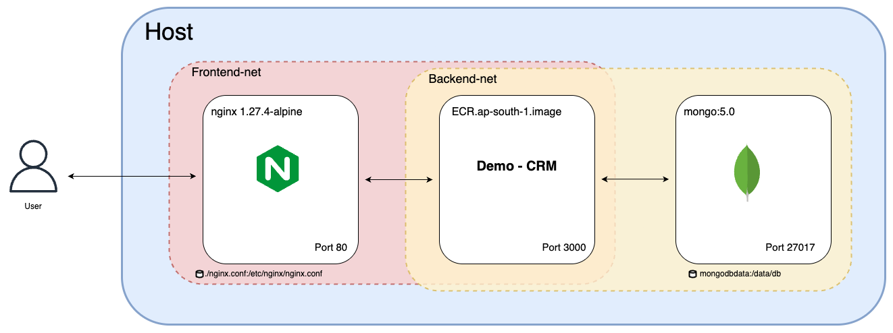
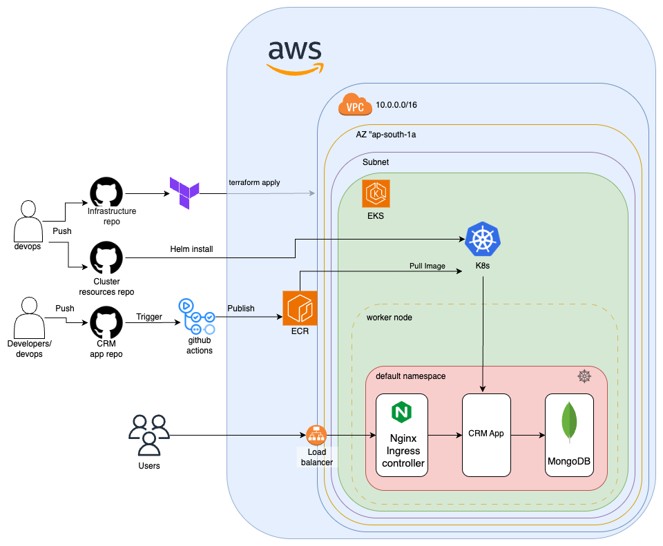

<<<<<<< HEAD
# Demo CRM App
Simple crm app that allows you to save information about clients to a mongodb database, and retrieve the data.

## Architecture
This app has two other repos related to it - 
1. Infra repo - https://github.com/Asher-Avraham/CRM-Infrastructure-final-project
2. Helm charts and other k8s cluster resources - https://github.com/Asher-Avraham/CRM-cluster-resources-final-project
=======
## CRM Application - overview

This repository contains the source code for a Customer Relationship Management (CRM) application. The app allows to add and view clients. It includes a Docker Compose setup for local development and a Dockerfile for a production image. The application also features a GitHub Actions workflow for continuous integration with automated versioning and deployment.
>>>>>>> 90beee5 (implementing improvments suggested by idan)

## Technologies Used

-   **Next.js:** React framework for building server-rendered applications.
-   **Node.js:** JavaScript runtime environment.
-   **React:** JavaScript library for building user interfaces.
-   **MongoDB:** NoSQL database for data storage.
-   <del>**RabbitMQ:** Message broker for asynchronous communication.</del>
-   **Docker:** Containerization platform.
-   **Nginx:** Web server and reverse proxy.
-   **Tailwind CSS:** Utility-first CSS framework.

## Docker Compose Diagram



## Workflow Architecture Diagram



## Setup Instructions

### Prerequisites

-   Docker and Docker Compose installed.
-   Node.js and Yarn installed (if developing locally).

### Development Setup (Local)

1.  **Install Dependencies:**

    ```bash
    yarn install
    ```

2.  **Start MongoDB and RabbitMQ (using Docker Compose):**

    ```bash
    docker-compose up -d mongo rabbitmq
    ```

3.  **Run the Application:**

    ```bash
    yarn dev
    ```

4.  **Access the application:**

    Open your browser and navigate to `http://localhost:3000`.

### Docker Deployment

1.  **Build the Docker Image:**

    ```bash
    docker build -t your-app-name .
    ```

2.  **Run the Docker Container (with Docker Compose):**

    ```bash
    docker-compose up --build -d
    ```

3.  **Access the Application:**

    Open your browser and navigate to the appropriate port (e.g., `http://localhost:80`). The port used is configured in the `docker-compose.yaml` and `nginx.conf` files.

### Configuration

-   **MongoDB Connection:** The MongoDB connection string is handled in `lib/mong-connect.js`. Ensure it's configured correctly for your environment.
-   <del>**RabbitMQ Connection:** The RabbitMQ connection settings are in `lib/rabbitmq.js`. Adjust them as needed.</del>
-   **Nginx Configuration:** The `nginx.conf` file configures the reverse proxy. Modify it to suit your deployment needs.
-   **Environment Variables:** If you have environment variables, make sure to set them either in your `.env.local` file for development or in your Docker Compose file for production.

### API Endpoints

-   `/api/clients`: Retrieves a list of clients.
-   `/api/news`: Retrieves the latest news.

### Notes

-   Version number is stored in version.txt
